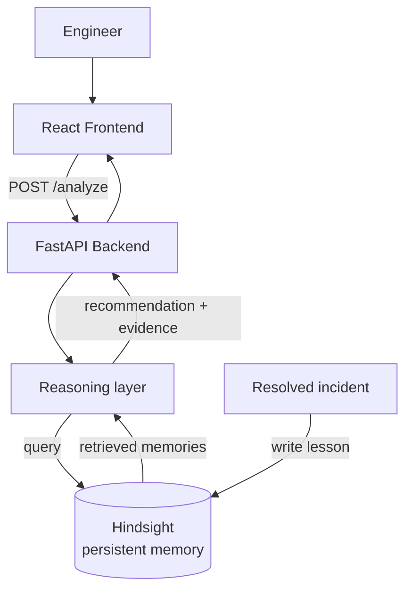

# RECALL — AI Incident Response Agent

RECALL is an AI agent that helps engineers respond to production incidents by recalling how the same team handled similar problems before — the root cause, what was tried, what failed, what actually worked — and using that history to ground its recommendation.

It is built on [Hindsight](https://github.com/vectorize-io/hindsight), which stores and retrieves the persistent memory RECALL relies on. Hindsight isn't a add-on here — every recommendation RECALL makes is generated *from* what it retrieves from Hindsight for that specific incident.

Demo link: https://youtu.be/VD6OAr7gT30?si=s-6oYEuIdGJHg8M4

---

## The problem

When a production system fails, the information needed to fix it usually already exists somewhere: old incident reports, postmortems, Slack threads, or a specific engineer's memory of "we tried that already, it didn't work." The problem isn't a lack of information — it's that this experience is scattered and hard to retrieve at the moment it's actually needed.

Generic AI assistance doesn't solve this. Asked about a latency spike, a model with no access to your team's history will suggest the standard checklist — check the database, inspect network latency, add replicas — regardless of whether your team has already tried and ruled out that exact fix.

RECALL is scoped to one workflow: **help an engineer respond to a production incident using their own team's prior incidents, decisions, and lessons**, retrieved from Hindsight at query time.

## Before / after: what memory actually changes

This is the same question, asked with and without the Hindsight-backed memory RECALL retrieves.

**Question:** *"Payment API latency is currently very high. Should we increase the number of Payment Service replicas?"*

| Without memory (generic model response) | With RECALL (grounded in retrieved Hindsight memory) |
|---|---|
| "Try increasing replicas, check the database, and inspect network latency for bottlenecks." | "Don't increase replicas yet. A previous incident on this service (INC-0192) tried scaling replicas from 8 → 16, and latency did not improve. The root cause was database connection pool exhaustion — increasing the pool from 100 → 250 resolved it. Check current pool utilization before scaling replicas." |

The left column is generic advice available without any retrieval step. The right column is only possible because RECALL queried Hindsight for prior incidents on this service, retrieved the matching incident record, and grounded its answer in the recorded outcome — not because a model has memorized this pattern.


## How Hindsight is used

RECALL calls Hindsight at two points:

1. **Retrieval, on every incident query.** When an engineer submits a problem and its current context, the backend queries Hindsight for memories relevant to that service and symptom, and passes what it retrieves into the recommendation step.
2. **Write, after an incident is resolved.** When an engineer saves a resolved incident's lesson, it's written back into Hindsight so future queries against the same service can retrieve it.

### Retrieval — real code

```python
# backend/[actual file path, e.g. reasoning/recall.py]

# PASTE THE ACTUAL FUNCTION THAT QUERIES HINDSIGHT HERE.
# Include the real Hindsight client call (e.g. client.query(...) / client.search(...)),
# the parameters you pass (query text, filters, top_k, etc.), and how the
# returned memories are passed into /analyze's response.
```

### Write-back — real code

```python
# backend/[actual file path, e.g. reasoning/retain.py]

# PASTE THE ACTUAL FUNCTION THAT WRITES A RESOLVED LESSON BACK TO HINDSIGHT.
# If this endpoint doesn't exist yet and lesson-saving is still UI-only,
# say that explicitly here instead of showing code that doesn't run —
# see "Current limitations" below.
```

### Where this sits in the request path

`POST /analyze` — [confirm this is still your real route]

```json
// Request
{
  "problem": "Payment API latency is currently very high. Should we increase the number of Payment Service replicas?",
  "current_context": "Payment Service. Production. Strong transactional consistency required."
}
```

```json
// Response
{
  "problem": "string",
  "current_context": "string",
  "recommendation": "string",
  "historical_evidence": ["string", "..."]
}
```

`historical_evidence` is populated directly from what Hindsight returns for this query — it is not hardcoded or templated per incident type.

## Architecture



Hindsight is the only store of incident history in this system. The reasoning layer does not have its own database of past incidents — everything it can recall comes from what Hindsight returns for a given query. Remove Hindsight from the path and RECALL has no history to draw on; it falls back to the same generic response shown in the "before" column above.

## Persistent memory and improvement across interactions

RECALL's memory is persistent in two concrete, testable ways:

1. **Retrieval survives across sessions.** A memory written to Hindsight (either seeded, or saved from a resolved incident) is retrievable in a later, unrelated session — not just within the same conversation or browser session. [Confirm this is true in your implementation, and if you have a way to demonstrate it — e.g. restart the backend and query again — describe it here.]
2. **New resolutions become future context.** When an engineer resolves an incident and saves the lesson, that lesson is written back to Hindsight [or: is designed to be written back — see limitations below] and is retrievable by a subsequent, different query against the same service.

## What RECALL remembers

Memories retrieved from Hindsight fall into a few types, used to ground different kinds of questions:

- **Production incidents** — symptom, service, timeline
- **Failed approaches** — what was tried and didn't work
- **Root causes** — the actual underlying cause, once identified
- **Successful resolutions** — what fixed it
- **Lessons learned** — the actionable takeaway
- **Architecture decisions** — what was chosen for a service, and the constraint that drove it

The architecture-decision type also enables a second behavior: when a past decision is retrieved but its original context (e.g. a consistency requirement) doesn't match the current situation, RECALL surfaces the mismatch instead of reapplying the old decision. This is retrieval plus a comparison step against the current query's stated context — it is not a separate rules engine.


## Current limitations

- [State plainly whether "save lesson" currently writes to Hindsight, or is still UI-only pending a backend route. Be exact — this is a judged criterion and an unfilled or incorrect claim here is worse than an honest gap.]
- Retrieval currently [ranks by keyword overlap / is unranked / describe your actual method — do not describe it as more sophisticated than it is].
- No relevance threshold is currently applied beyond [describe, or state "none" if evidence is returned unfiltered].

## Getting started

### Prerequisites
- Python 3.10+
- Node.js 18+
- A Hindsight instance and API key

### Backend

```bash
cd backend
pip install -r requirements.txt
cp .env.example .env   # add your Hindsight API key
uvicorn main:app --reload
```

Runs at `http://127.0.0.1:8000`.

### Frontend

```bash
cd frontend
npm install
npm run dev
```

Runs at `http://localhost:5173`.

### Seed data

The demo uses a fictional engineering organization (NovaPay) so the project doesn't depend on real company data. Seed it with:

```bash
cd backend
python scripts/seed_hindsight.py
```


